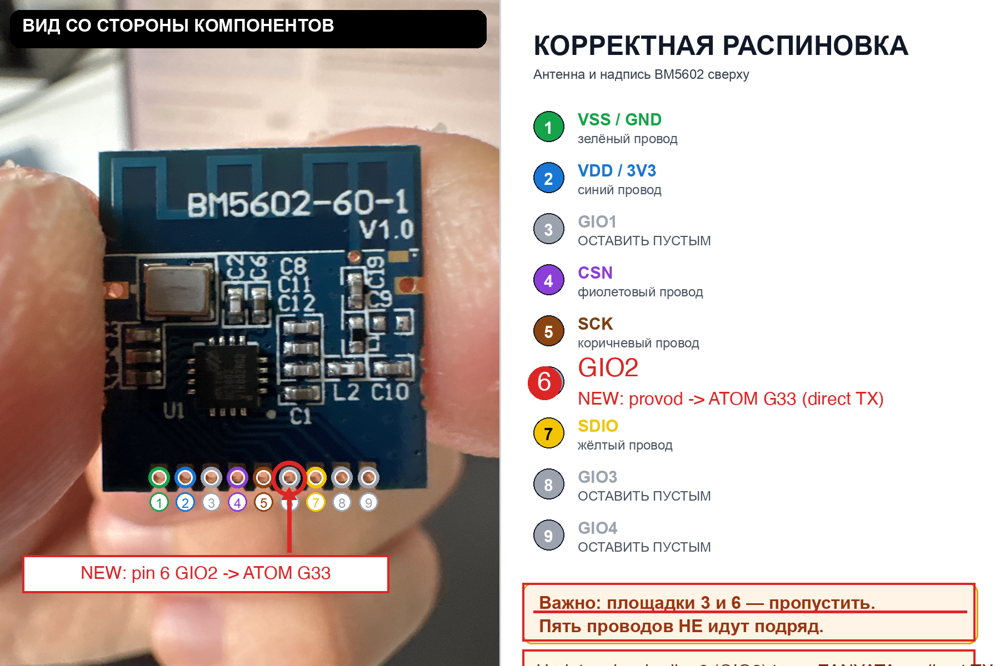
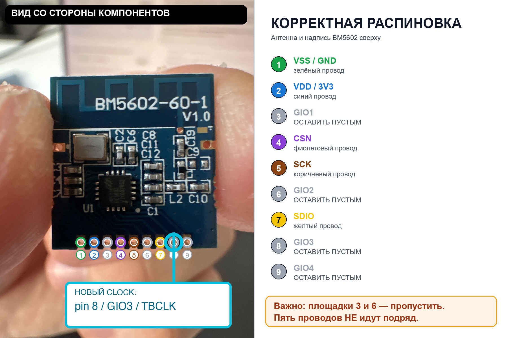
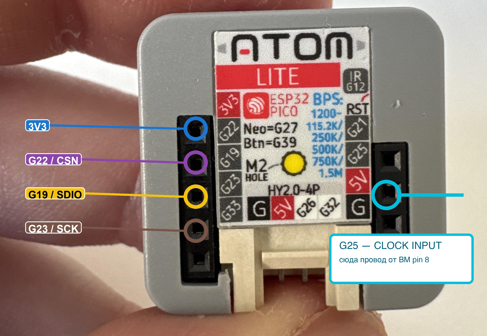

# Wiring and soldering

> **3.3 V only.** Disconnect USB power before soldering. Verify continuity and the absence of shorts before reconnecting power.

## Required connections

| BM5602 | Module pin | M5Stack ATOM Lite | Purpose |
|---|---:|---|---|
| GND | — | GND | Ground |
| 3V3 | — | 3V3 | Power |
| CSN | — | GPIO22 | SPI chip select |
| SCK | — | GPIO23 | SPI clock |
| SDIO | — | GPIO19 | SPI MOSI |
| GIO2 | pin 6 | GPIO33 | SPI MISO / direct TX data |
| GIO3 | pin 8 | GPIO25 | TBCLK synchronization |

The seventh connection, **GIO3/TBCLK → GPIO25**, is mandatory. Packet-engine transmission looked correct in software but was rejected by the tested lamp. Clock-synchronous direct mode produced the bit-exact stock frame accepted by the lamp.

## Correct BM5602 pin identification

Do not confuse GIO2 and GIO3:

- **pin 6 = GIO2**
- **pin 8 = GIO3 / TBCLK**

## TBCLK solder point

Use a fine tip, flux, and a thin insulated wire. Tin the wire first and keep heating time short.

## ATOM Lite GPIO25 solder point

## Before flashing

Check with a multimeter:

1. GND continuity between both boards.
2. No short between 3V3 and GND.
3. GIO2 reaches GPIO33 only.
4. GIO3 reaches GPIO25 only.
5. No bridge between adjacent BM5602 pins.
