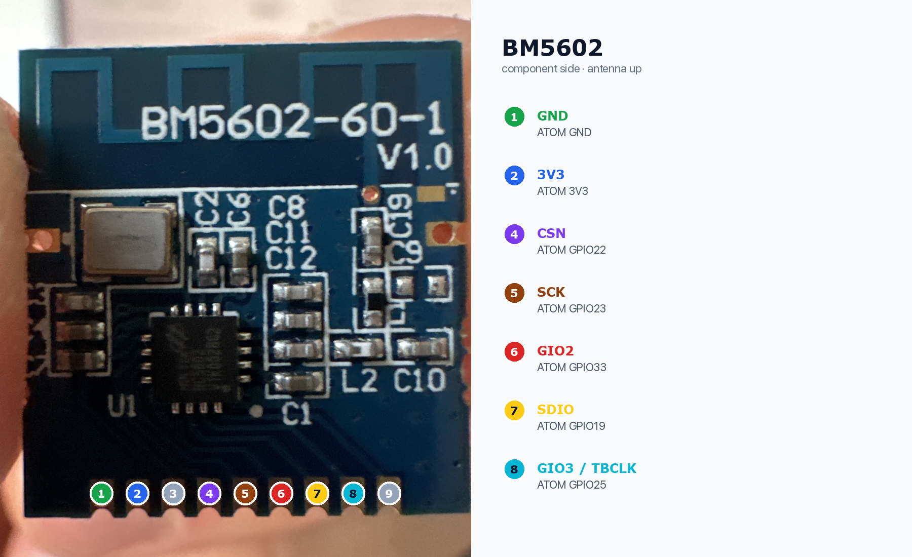
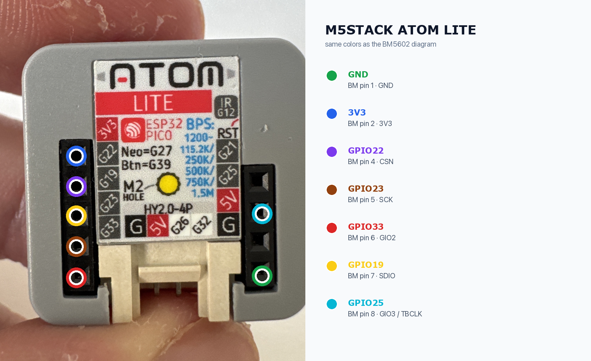

# Wiring

## BM5602

## M5Stack ATOM Lite

| BM5602 | Pin | M5Stack ATOM Lite |
|---|---:|---|
| GND | 1 | GND |
| 3V3 | 2 | 3V3 |
| CSN | 4 | GPIO22 |
| SCK | 5 | GPIO23 |
| GIO2 | 6 | GPIO33 |
| SDIO | 7 | GPIO19 |
| GIO3 / TBCLK | 8 | GPIO25 |

Pins 3 and 9 are not connected. Supply voltage is 3.3 V.
